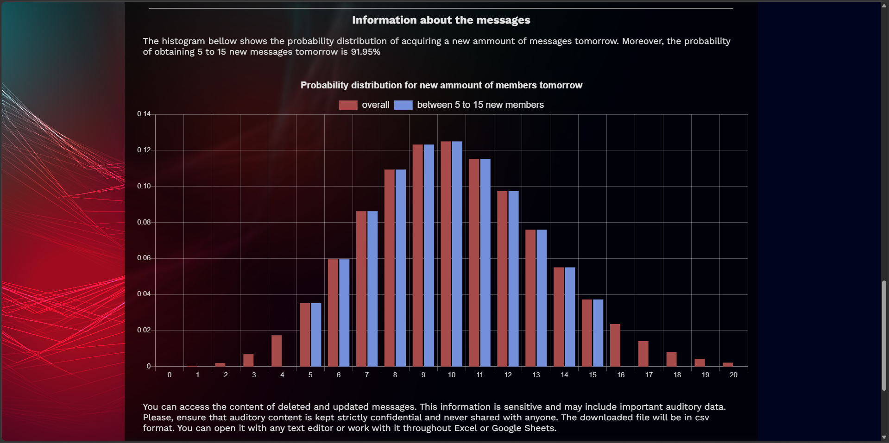
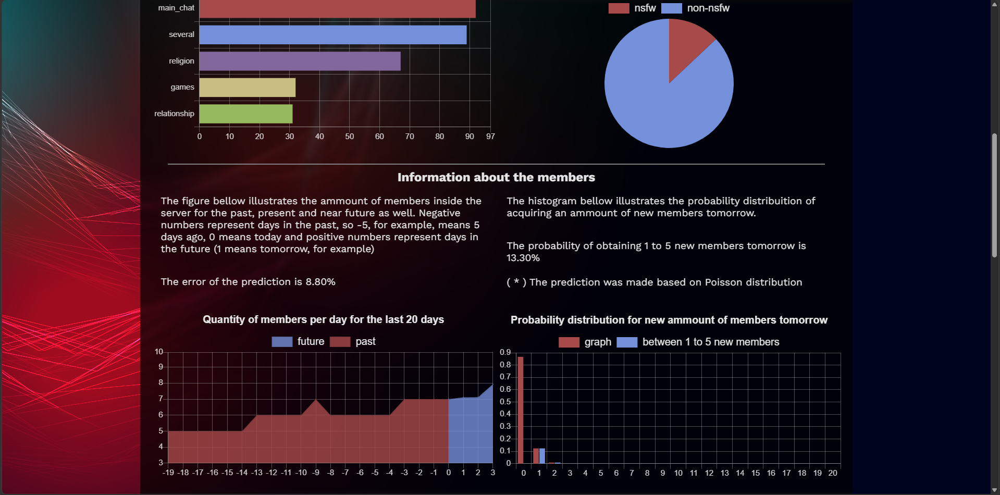

**Web Site for the Maned Wolf Discord Bot**

---

**Overview**

This repository contains only the frontend of the application. It does not implement any business logic itself — it is a pure consumer of a REST API provided by a separate backend project. All data displayed here (authentication, analytics, message history, etc.) is fetched from that external API.

The project with the API and the bot is: https://github.com/ErickPereira-hub/Maned-Wolf-Discord-BOT

---

**Features**

**Discord Bot Tutorial Page**

The site includes a dedicated page with a step-by-step tutorial explaining how to use the Discord bot associated with this platform. This page is purely informational and does not interact with the backend API.

**Authentication (Login / Logout)**

There is a login and logout page responsible for handling user authentication. This page communicates with the backend project via JWT tokens stored in cookies

No token handling or business logic is done on the frontend beyond sending/receiving these cookies — all validation happens on the backend.

**Analytics Dashboard**

The dashboard page displays the results of data analysis performed on the Discord servers, including forecast prediciton analysis of number of members and number of messages in the near future. It presents aggregated statistics and insights fetched from the backend API, giving users a visual overview of server activity and trends.

The graphical results were built with the library Chart.js

**Message Audit CSV Export**

The application provides a feature to download a CSV audit report of deleted and edited messages within a Discord server. This report includes:

➤ Messages that were deleted, along with the original content before deletion.
➤ Messages that were edited, along with the original content before the edit.

**Notes**

➤ This project is frontend-only. All persistent data, authentication logic, analytics processing, and audit logging live in the backend project.
➤ Authentication state is managed via JWT cookies exchanged with the backend; the frontend does not independently issue or verify tokens.

